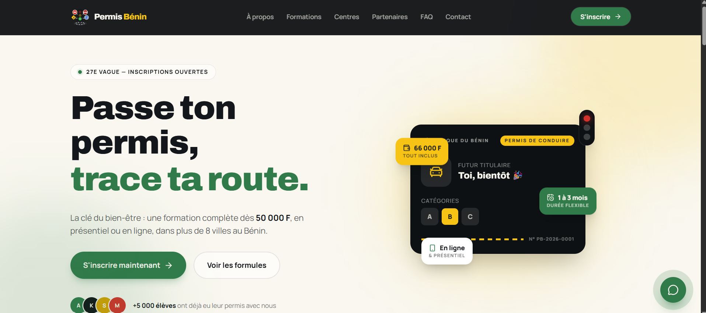
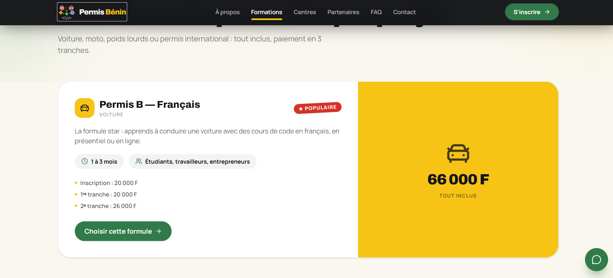
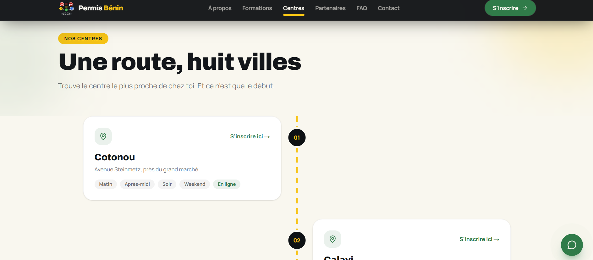
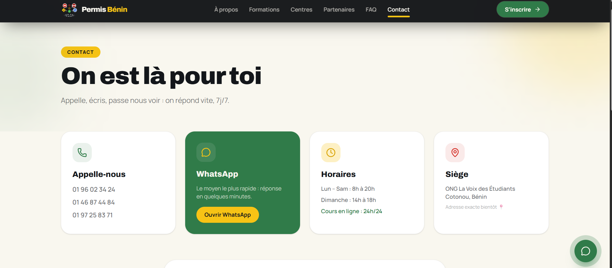

# Permis Bénin

> A web platform designed to modernize driving school management and help learners manage their driving lessons in Benin.

[](https://permis-benin-six.vercel.app/)

## Overview

**Permis Bénin** is a personal full-stack project focused on building a modern digital experience for driving schools and driving learners in Benin.

The platform is designed to centralize key learner interactions such as registration, profile management, driving lesson booking, course scheduling, and access to driving school information.

The project follows a separated frontend/backend architecture, with a modern web frontend communicating with a Symfony API.

## Key Features

* Student registration and profile management
* Driving lesson booking
* Course schedule consultation
* Driving school presentation
* Offers and pricing information
* Contact information
* REST API architecture

## Tech Stack

### Frontend

* Next.js
* React
* TypeScript
* Tailwind CSS
* Motion
* Lucide React

### Backend

* Symfony
* API Platform
* Doctrine ORM

### Database

* MySQL / PostgreSQL

## Architecture

The project is structured around a separated frontend and backend architecture:

```text
┌─────────────────────────────┐
│        Next.js Frontend     │
│                             │
│  React + TypeScript         │
│  Tailwind CSS               │
└──────────────┬──────────────┘
               │
               │ HTTP / REST API
               ▼
┌─────────────────────────────┐
│      Symfony Backend        │
│                             │
│  Symfony + API Platform     │
│  Doctrine ORM               │
└──────────────┬──────────────┘
               │
               ▼
┌─────────────────────────────┐
│          Database           │
│       MySQL / PostgreSQL    │
└─────────────────────────────┘
```

## Project Structure

```text
permis-benin/
│
├── src/
│   └── ...
│
├── public/
│
├── package.json
├── tsconfig.json
├── next.config.ts
├── tailwind.config.*
└── README.md
```

## Getting Started

### Prerequisites

Make sure you have installed:

* Node.js
* npm
* PHP
* Composer
* Symfony CLI
* MySQL or PostgreSQL

### Frontend

Install dependencies:

```bash
npm install
```

Create your local environment file:

```bash
cp .env.example .env.local
```

Start the development server:

```bash
npm run dev
```

The application will then be available locally through the Next.js development server.

### Backend

Install PHP dependencies:

```bash
composer install
```

Create your environment file:

```bash
cp .env.example .env
```

Create the database:

```bash
php bin/console doctrine:database:create
```

Run migrations:

```bash
php bin/console doctrine:migrations:migrate
```

Start Symfony:

```bash
symfony server:start
```

## Live Demo

The project is deployed and available online:

**https://permis-benin-six.vercel.app/**

## Project Status

This is an ongoing personal project.

The platform is being developed progressively, with additional features and improvements planned as the project evolves.

## Screenshots

Screenshots and visual demonstrations will be added here.

## What This Project Demonstrates

This project demonstrates practical experience with:

* Full-stack web application development
* React and Next.js development
* TypeScript
* Symfony backend development
* API Platform
* REST API integration
* Database-driven applications
* Frontend/backend separation
* Responsive user interfaces
* Modern web development tools

* ### Homepage


### About


### Services


### Features


### Contact


## Author

**Zahirou SAIDI**

Full-Stack Developer

* GitHub: https://github.com/SAIDI755
* LinkedIn: https://linkedin.com/in/zahirou-saidi-1380b5315

---

⭐ If you find this project interesting, feel free to explore the repository.
